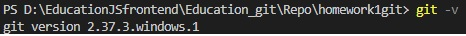
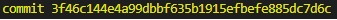
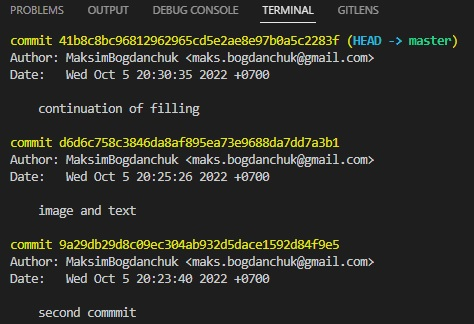
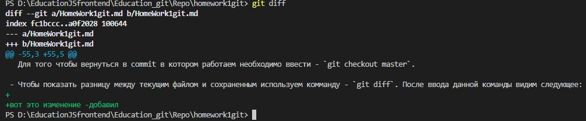

# Инструкция по работе в Git.

## Первое использование контроля версий

### I. Что нам необходимо для начала работы с Git (программа для контроля версий).

1. Проверить наличие установленной на ПК программы Git с помощью командной строки или терминала, делается это с помощью команды: `git --version` или `git -v`.

   Должно выдать что-то типо такого:

   > 

2. Создать папку в которой будет храниться наш Git-репозиторий (не используем кириллицу).

3. В папке создать файл с которым мы будем работать.

### II. Начинаем работу с контролем версий.

- Запускаем Visual Studio Code
- Открываем папку в которой у нас лежит файл с которым будем работать
- С помощью команды - `git init` начинается отслеживание изменений в папке

### III. Работа в Git

- Проверяем текущее состояние гита (есть ли изменения, которые необходимо закоммитить(сохранить)) с помощь команды - `git status`.
- Затем добавляем содержимое нашей папки (в данном случае файл) с помощью команды - `git add (name file)`.
- После нам необходимо сохранить изменения в файле произведенные за время работы с ним. Делается это с помощью команды - `git commmit`.

  Например:

  > `git commit -m "My first commit"`, где `-m` значит `message`.

  Таким образом мы даем себе и остальным информацию, какие трансформации в файле мы произвели.

  Каждому коммиту автоматически присваивается номер.

  Например:

  > 

- Для просмотра журнала изменений используют комманду

  > `git log`

  При вводе данной команды мы видим следующие изменения (`commit`)

  > 

- C помощью команды - `git checkout` мы можем переключаться между версиями. Для этого вводим -`git checkout` и номер commit.

  Например:

  > git checkout 9a29db29d

  Для того чтобы вернуться в commit в котором работаем необходимо ввести - `git checkout master`.

- Чтобы показать разницу между текущим файлом и сохраненным используем комманду - `git diff`. После ввода данной команды видим следующее:
  > 

Продолжаем написание инструкции.

Команда `git branch` выводит на экран список
имеющихся у нас веток.

Чтобы создать новую ветку - необходимо прописать всё тот же `git branch` + `name_branch`.

> Например `git branch homework2`

У нас создалось ответвление от ветки `master`.

Чтобы перейти к новой ветке, необходимо ввести `git checkout` + `name_branch`.

> В нашем случае это `git checkout homework2`.
